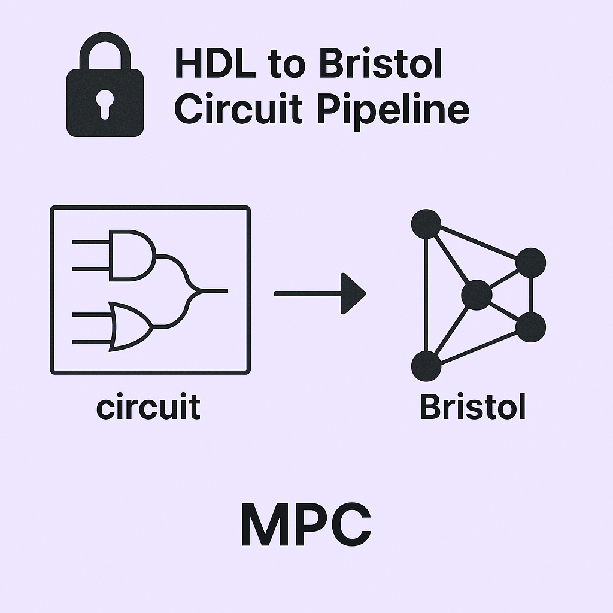

# 🔐 BristolCircuit



Welcome to **BristolCircuit** — a practical and reproducible reference for researchers and practitioners in **privacy-preserving cryptography**, with a strong focus on **Secure Multi-Party Computation (MPC)**.

---

## 📌 Overview

In MPC protocols, circuit representations are fundamental for enabling secure function evaluation across distributed inputs. These circuits support a wide range of operations, including:

- 🧮 **Arithmetic Operations**  
  Signed/unsigned addition, subtraction, multiplication, etc.

- 🧩 **Comparison Operators**  
  `==`, `!=`, `<`, `<=`, `>`, `>=` for both integers and floating-point numbers.

- 🔐 **Cryptographic Primitives**
  - **SHA-2** hash functions
  - **Keccak-f** (core of **SHA-3**) permutation functions
  - **SHAKE256/512** extendable output functions (XOFs)

Circuits used in these protocols are commonly written in the **Bristol format**. While small circuits can be manually authored, this method becomes impractical for real-world cryptographic applications.

---

## ⚙️ Recommended Workflow

This repository offers a complete, scalable flow from HDL to MPC-ready circuits using the following steps:

1. **Write the design** in a hardware description language such as **Verilog**.
2. **Synthesize the HDL** into a netlist using tools like [Yosys](https://www.yosyshq.com/).
3. **Convert the netlist** into the **Bristol format** using transformation scripts or frameworks such as [SCALE-MAMBA](https://github.com/KULeuven-COSIC/SCALE-MAMBA).

---

## 💡 Motivation

During my Ph.D. research, I observed a significant gap: although tools for each step of the HDL → Bristol pipeline exist, there was **no unified, documented workflow** connecting them. This repository was created to:

- Bridge that gap with a full-stack, reproducible solution.
- Deliver ready-to-use circuits for testing and benchmarking MPC protocols.
- Empower the community to build and share complex cryptographic circuits confidently.

---

## 🎯 Project Goals

- ✅ Publish high-quality, reusable circuits in Bristol format
- ✅ Provide a transparent HDL → Netlist → Bristol pipeline
- ✅ Ensure reproducibility and scalability
- ✅ Serve as both a **practical toolkit** and an **educational resource**

---

## 📚 Citation

If you use **BristolCircuit** in academic or industrial work, please cite:

```bibtex
@misc{bristolcircuitlib2025,
  author       = {Kiarash Sedghighadikolaei},
  title        = {BristolCircuitLib: Practical Bristol Circuit Reference for Privacy-Preserving Cryptography},
  year         = {2025},
  howpublished = {\url{https://github.com/kiarashsedghigh/BristolCircuit}},
}
```

# 🔧 Installation

To set up the pipeline, you’ll need the following tools installed on your system:

1. **Verilog IDE**  
   A development environment for writing and simulating Verilog code. Recommended options include:
  - [Xilinx Vivado](https://www.xilinx.com/products/design-tools/vivado.html) (feature-rich, industry standard)
  - [EDA Playground](https://www.edaplayground.com/) (free, web-based)

2. **Yosys**  
   An open-source framework for RTL synthesis and optimization.  
   📦 Installation and usage instructions: [Yosys GitHub Repository](https://github.com/YosysHQ/yosys)

3. **SCALE-MAMBA**  
   A high-performance MPC framework developed by KU Leuven.  
   📦 Installation guide: [SCALE-MAMBA GitHub Repository](https://github.com/KULeuven-COSIC/SCALE-MAMBA)

#💡 Example: 32-bit Adder Circuit

This section demonstrates how to design, synthesize, and prepare a simple 32-bit unsigned adder circuit for use in the Bristol circuit format.

---

## 🧾 Step 1: Write the Verilog Code

Save the following Verilog code as `adder32.v`:

```verilog
module adder_32bit_unsigned (
    input  [31:0] a,
    input  [31:0] b,
    output [32:0] sum
);
    assign sum = a + b;
endmodule
```
You can write a testbench for this code and test it in your favorite IDE.


## ⚙️ Step 2: Generate the Netlist Using Yosys

Once your Verilog file is ready, the next step is to synthesize it into a gate-level netlist using [**Yosys**](https://github.com/YosysHQ/yosys).

Launch the Yosys shell by running:
```bash
yosys
```

```bash
yosys> read_verilog YOUR_VERILOG_FILE.v
yosys> hierarchy -check -top TOP_MODULE
yosys> proc; opt; memory; opt; fsm; opt; techmap; opt;
yosys> abc -liberty ASIC_FILE
yosys> opt
yosys> write_verilog YOUR_VERILOG_FILE.net
yosys> exit
```
All the commands above are to be executed inside the **YOSYS shell**, which you can enter by running `yosys` in your terminal.


#### ⚠️ Note on Hierarchical Designs
If your top-level Verilog module calls other submodules, you'll need to **flatten** the design before generating the netlist.
This ensures that the final netlist represents a single, self-contained module — required for having one single Bristol circuit.

```bash
yosys> flatten; clean;
yosys> proc; opt; memory; opt; fsm; opt; techmap; opt;
```


### 📝 Additional Notes:
1. **`YOUR_VERILOG_FILE.v`** – The path to your Verilog source file (e.g., `adder32.v`). This can be either absolute or relative.
2. **`TOP_MODULE`** – The name of your top-level module in the Verilog code (e.g., `adder_32bit_unsigned` in the example above).
3. **`ASIC_FILE`** – Path to a Liberty file that specifies the gate library to use during synthesis.  
   For MPC applications, you should use a minimal gate set consisting of:
  - `AND`
  - `XOR`
  - `INV`

   👉 A sample Liberty file is provided in the `src/` directory for your convenience.

After executing the above commands, you will have a netlist file (e.g., `adder32.net`).


## 🧹 Step 3: Post-Process the Netlist

### ✂️ a. Remove Yosys Metadata

```verilog
/* Generated by Yosys 0.33 (git sha1 2584903a060) */
(* top =  1  *)
(* WHATEVER_HERE *)
```


### 🔄 b. Reorganize Input/Output Declarations

Move the input and output declarations (can be found after wire definitions) to the beginning of the module, and remove the `wire` declarations for them. For instance:

Before:
```verilog
/* Generated by Yosys 0.33 (git sha1 2584903a060) */

(* top =  1  *)
(* WHATEVER_HERE *)
module adder_32bit_unsigned(a, b, sum);
  wire _000_;
    .
    .
    .
```
After:
```verilog
module adder_32bit_unsigned(a, b, sum);
  input [31:0] a;
  input [31:0] b;
  output [32:0] sum;
  wire _000_;
  wire _001_;

```
and remove wires for input/output:

Before:
```verilog
    .
    .
    .
  wire _267_;
  wire _268_;
  wire [31:0] a;
  wire [31:0] b;
  wire [32:0] sum;
  INV _269_ (
    .A(b[7]),
    .Z(_267_)
  );
```

After:
```verilog
    .
    .
    .
  wire _267_;
  wire _268_;
  INV _269_ (
    .A(b[7]),
    .Z(_267_)
  );
```

### 📏 c. Flatten Gate Definitions

Ensure that each gate entry in the file is written on a single line for compatibility with our next step.

Before:
```verilog
  INV _269_ (
    .A(b[7]),
    .Z(_267_)
  );
```

After:
```verilog
  INV _269_ (.A(b[7]),.Z(_267_));
```

### 🧽 d. Remove Blank Lines
Eliminate any unnecessary blank lines in the file to avoid processing errors.


## 🔄 Step 4: Convert Netlist to Bristol Format
Now that the .net file is clean and properly formatted, you can convert it into Bristol format, which is widely used in MPC frameworks.

To do so, use the convert.x tool provided by SCALE-MAMBA.

⚙️ Instructions:
Compile the convert.x tool as per the instructions in the SCALE-MAMBA repo. Run the tool on your cleaned .net file to produce a .bristol output. Once complete, you’ll have a valid Bristol circuit ready for use in privacy-preserving computation!

---

# 📁 Structure of Files

The `src/` directory is organized into two main subfolders:

- `Existing/`: Contains well-known Bristol circuits collected from various online sources.  
  Each circuit is accompanied by documentation or a reference to its origin where available.

- `Generated/`: Contains circuits created as part of this project.  
  While not yet comprehensive, these circuits are optimized and in many cases more efficient than publicly available alternatives.

---

### 🗂️ Directory Overview

| Folder           | Description                                                                 | Examples                       |
|------------------|-----------------------------------------------------------------------------|--------------------------------|
| `src/Existing/`  | Collection of previously published circuits from the internet               | `SHA256.txt`, `AES.txt`        |
| `src/Generated/` | Project-generated circuits with improved efficiency and simplified logic | `Keccak-f-1600`, `adder32.txt` |

---

✅ Note: New optimized circuits will continue to be added to the `Generated/` folder as the project evolves.


